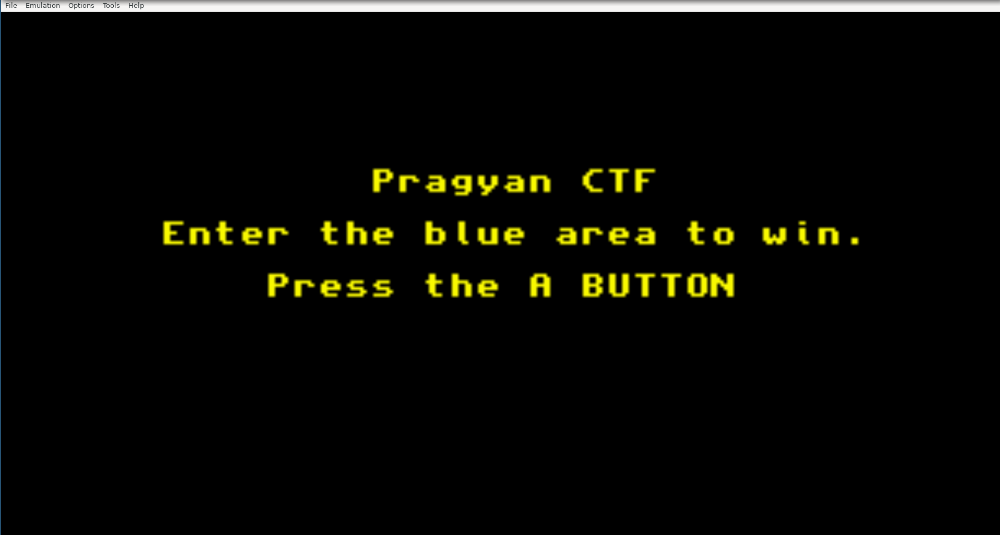
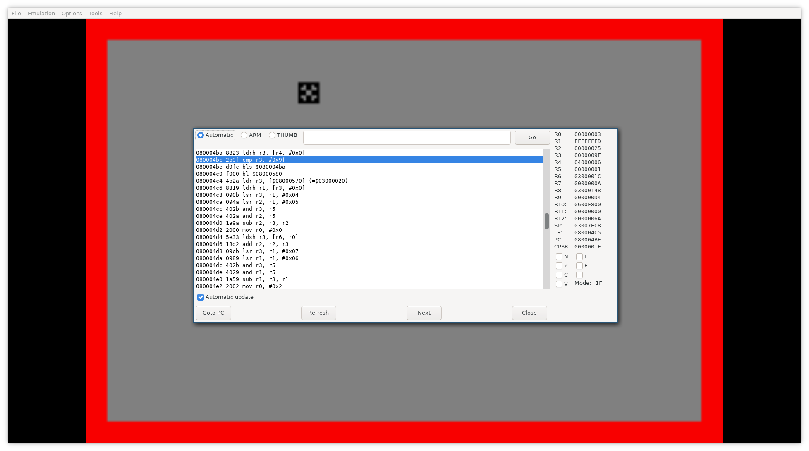
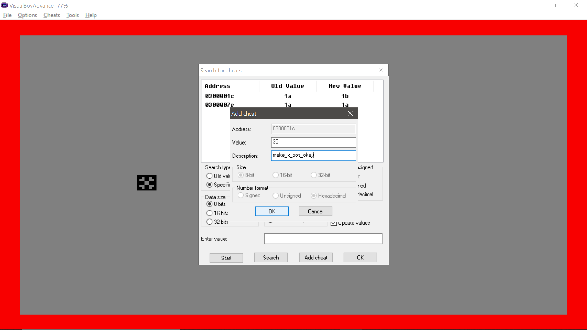
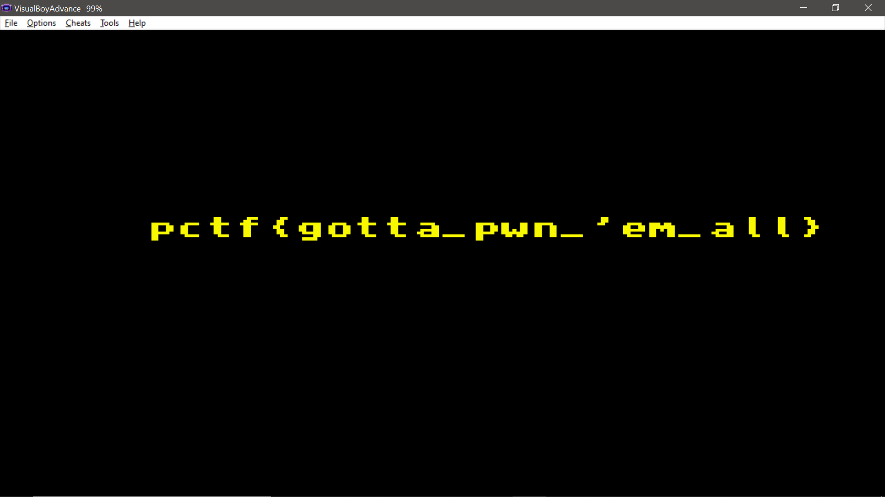

# RetroPwn - Writeup
We are given a Game Boy Advance ROM. There are many emulators available for this platform, one of the most popular being [visualboyadvance-m](https://github.com/visualboyadvance-m/visualboyadvance-m).
Opening it, we get a welcome screen.
Then, we proceed to encounter this screen.

We can move around the little cross using arrow keys. The objective is to somehow get to the blue square in the middle, but the red walls do not allow the cross to pass through them.
Now we inspect the program using VBA-M's disassembly tool. With the automatic update option checked, we can see the execution of the program in real time.
The GBA hardware has an [ARM7TDMI processor](https://developer.arm.com/documentation/ddi0210/c/), which uses a 32-bit RISC architecture. GBA games usually use a mixture of ARM and THUMB instructions.
It is now useful to read a bit about the GBA's hardware and about the ARM7TDMI's ISA.
Specifically, it is useful to know about the memory layout of the GBA.
|Area|Start|End|Description|
|--|--|--|--|
|System ROM|`0000:0000h`|`0000:3FFFh`|BIOS memory|
|EWRAM|`0200:0000h`|`0203:FFFFh`|External Work RAM|
|IWRAM|`0300:0000h`|`0300:7FFFh`|Internal Work RAM|
|IO RAM|`0400:0000h`|`0400:03FFh`|Memory-mapped IO registers|
|PAL RAM|`0500:0000h`|`0500:03FFh`|Palette RAM|
|VRAM|`0600:0000h`|`0601:7FFFh`|Video RAM|

The IWRAM area is of special interest to us, as it holds all the variables used by the program during execution.

By playing around we can observe that there is a main loop which checks our movement, and some of the registers track the position of the cross.
Of particular interest are the locations 0x0300001C and 0x0300001E, which keep track of the input strokes we input (not the cross position).
Trying to change the cross position does not work, as it is updated based on the key stroke inputs.
We can use VBA's cheat functionality to write the required position in those addresses. We align the Y position of the cross, and change the X position.

 
 And we get the flag!
 
 
