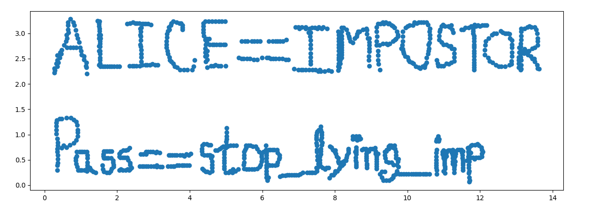
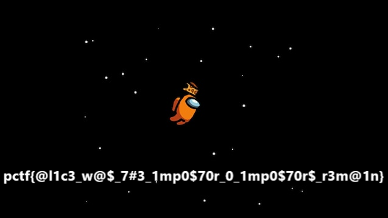

We are given a text file 'encrypted.txt' which contains a base64 text (encrypted) and there is no context provided/

After going through 'question.py' it is clear that:

* the quantum channel uses [BB84 protocol](https://en.wikipedia.org/wiki/Quantum_key_distribution#BB84_protocol:_Charles_H._Bennett_and_Gilles_Brassard_(1984)).
* we have to send a list of 1024 photons.
* and the basis used to determine those photons' polarization.
* 1: rectilinear basis, 0: diagonal basis.
* Alice will generate a random basis.
* our photons will be measured using that basis.
* Alice will send us her basis.
* We (Bob) and Alice will calculate a 256-bit shared key which will be used for encrypting the communication with AES/ECB.

```python
from Crypto.Cipher import AES
from Crypto.Util.Padding import pad, unpad
import compress_pickle
import random
import base64

bits = ''.join(random.choice('01') for i in range(1024))
basis = ''.join(random.choice('01') for i in range(1024))

photons = []
for i in range(1024):
    if basis[i] == '1':
        if bits[i] == '1':
            photons.append(complex(0, 1))
        else:
            photons.append(complex(1, 0))
    else:
        if bits[i] == '1':
            photons.append(complex(0.707, -0.707))
        else:
            photons.append(complex(0.707, 0.707))

photons = compress_pickle.dumps(photons, compression='bz2')
photons = base64.b64encode(photons).decode()  # send to Alice

basis = bytes([int(basis[i:i+8], 2) for i in range(0, len(basis), 8)])
basis = base64.b64encode(basis).decode()  # send to Alice
```

After this we receive a basis which Alice used (different each time)
We can calculate a shared key using this basis and the basis & bits we sent.
Using this key we have to decrypt the message sent by Alice.

```python
alice_basis = 'PW9oc9bSrqsm5Ofe9+VcuWNEdNeoplUWCljBZ41NoN6zQmD2VhkRW+dT648OW9OfQUnoO8aK79d21zhORJWUBNgncSp45BW9voPBzCg75E6cmJEx3/x7U8nr6+O1UZmnKV0BIMoadH70eyX2YsYedEz8X9Xd9rmrQgGuMjueQEg='

message = '4zc8ujC55JYQrk3paN8zmhcadsEFbD6JJwY2G5i6aGW5yxXz2QFhUr+ZFaNBu4IsXHI/6VsZKDfkgWCJeRA4UA=='
message = base64.b64encode(message.encode())

shared_key = ''
for i in range(1024):
    if basis[i] == alice_basis[i]:
        shared_key += bits[i]
shared_key = shared_key[:256]
shared_key = bytes([int(shared_key[i:i+8], 2) for i in range(0, len(shared_key), 8)])

decrypted = AES.new(shared_key, AES.MODE_ECB).decrypt(message)
decrypted = unpad(decrypted, AES.block_size).decode()
```

This gives us an exception which is possible only when the keys used by us and alice are different.

Lets try to switch the channel at this point. Alice asks us for the reason to do so. What could be a valid reason?

The keys should not differ if the BB84 protocol is followed correctly.
However there is one instance where this difference can arise, i.e, some of the photons somehow got corrupt during the transmission.
This indicates that there should've been a middleman who tried to measure the photons but couldn't do so precisely because of the [no-cloning theorem](https://en.wikipedia.org/wiki/No-cloning_theorem).

So a possible reason for switching the channels can be `I think someone is eavesdropping on us`.
This works! In fact, any string containing 'eavesdrop' works.

Alice gives us the key to decrypt the contents of 'encrypted.txt':

```python
alice_key = '0E0pnkUOghl9XVQjKJ3yvFZ7NP2KFw81N8kHcEn29NY='
alice_key = base64.b64decode(alice_key.encode())

with open('encrypted.txt', 'rb') as f:
    alice_photons = f.read()

alice_photons = base64.b64decode(alice_photons)
alice_photons = AES.new(alice_key, AES.MODE_ECB).decrypt(alice_photons)
alice_photons = unpad(alice_photons, AES.block_size)
alice_photons = compress_pickle.loads(alice_photons, compression='bz2')

print(alice_photons)
```

It is a list of 1024 photons (complex numbers) but they are not the same as the photons used for key distribution. So whats the matter?
Lets consider each of these photons as a point in 2D space and try plotting them.

```python
import numpy
from matplotlib import pyplot

alice_photons = [[float(photon.real), float(photon.imag)] for photon in alice_photons]
points = numpy.array(alice_photons)
x, y = points.T

pyplot.scatter(x, y)
pyplot.show()
```

BOOYAH! Finally some relief to the eyes. We get this:



So Alice is an impostor and the so called PASSWORD to something is `stop_lying_imp`. The eavesdropper seems to be having good intentions.

On the other hand, Alice has switched back to the quantum channel and we are asked for photons and basis again.
Maybe this time the keys will match! (hopefully). Yes they do.

The message is: `The launch codes are password protected. What is the password?`
We have the password, so lets encrypt it using the new shared key and send it to Alice.

Alice has realized that we know about her being a flat-earther and confesses by giving us the link to a file.
The file is a pdf revealing Alice's initial plans and mentioning her arrest.

So far so good but where the hell is the flag?
Reading the challenge description closely we find out that the alien race is called `CORKAMI` which turns out to be a github user popular for creating a tool called `MITRA` which is basically a binary polyglot generator.

Binary polyglots are files which can behave as two different files at the same time.
When we rename 'confession.pdf' to 'confession.zip' and open it, there is a file 'flag.png' which contains the flag.



Flag: `pctf{@l1c3_w@$_7#3_1mp0$70r_0_1mp0$70r$_r3m@1n}`