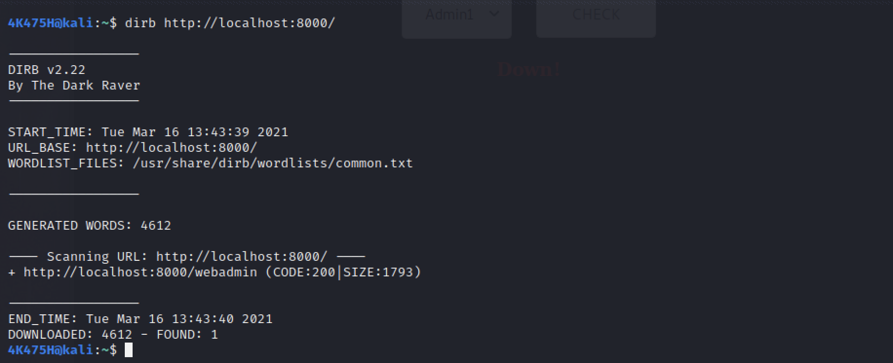

# Secret Is Secret

## First part of the challenge is to find the admin login portal

- Can be done easily using simple tools like dirbuster or dirb.
- the admin portal is in **/webadmin**

## Second part of the challenge is to intercept the request for the check button and find out OS Command injection.

- Can be done using tools like burpsuite.
- Change the request **connect_to=admin1** to **connect_to=admin1;cat /etc/passwd**
- The etc/passwd has the passwords for admin1, admin2, admin3 out of which admin2 will log you in.

## The third part of the challenge is to decode the JWT Token of the cookie logs.

- Can be done <a href="https://www.jstoolset.com/jwt">online</a>