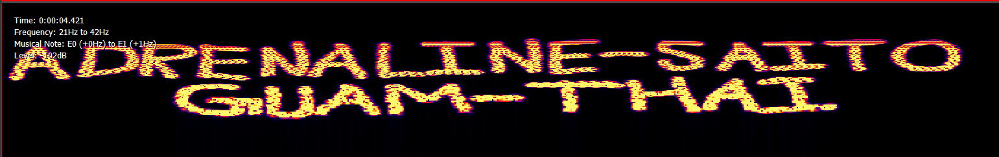
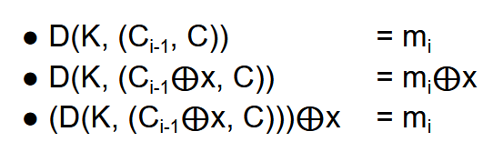

Robert William Taylor passed away at the age of 85 and provided the basis for this challenge.
Therefore it is obvious that the gibberish text is encoded in base85.

```python
from base64 import base85decode

with open('gibberish.txt', 'rb') as f:
    data = f.read()

try:
    while True:
        data = b85decode(data)
except:
    pass

data = data[1:].decode()
print(data)
#zeekzeedzeekedeezedzzzzdedeeekkzedeezdezekzkzdzzekekzdekekzkekdeekeezdekzdzzzdedzdzzekekekedzdzdekzkzdekekzkzdzzekedekeezdzzzdedekzdekezekzzzdezekzdzdzdzdekzdzezdek
```

Discard the null byte at the starting, its there just to prevent further base85 decoding of the text.
The decoded text is the correct password for the zip file.

This zip file contains two files:
* audio.wav
* encrypted.txt

The encrypted.txt contains some hexadecimal string which is surely encrypted but there is no mention of the encryption used.
The sound in audio.wav doesn't make any sense but reveals something when analyzed through an audio editor.
I used [wavepad](https://www.nch.com.au/wavepad/index.html) for this purpose.

Viewing the wave in Freuency View (log scale) gives -



It says "ADRENALINE-SAITO-GUAM-THAI" which rhymes with "ADENINE-CYTOSINE-GUANINE-THYMINE".
These are amino acids in out DNA so it is pointing towards [DNA Cryptography](https://www.geeksforgeeks.org/dna-cryptography/).

Taking a look back at the decoded text we got from the gibberish we realize that it contains only four alphabets - d, e, k, z.
Replace these with A, C, G, T in alphabetical order and we get a amino acid sequence.

DNA encoding is done in CTAG order, i.e -
* C = 00 (0)
* T = 01 (1)
* A = 10 (2)
* G = 11 (3)

Further replace the alphabets with 2-bit numbers to get a binary sequence.
This binary sequence contains valuable information when converted to ASCII text.

```python
table = {'d':'A', 'e':'C', 'k':'G', 'z':'T'}
data = ''.join(table[ch] for ch in data)

#CTAG = 0123
table = {'C':'00', 'T':'01', 'A':'10', 'G':'11'}
data = ''.join(table[ch] for ch in data)

data = ''.join(chr(int(data[i:i+8], 2)) for i in range(0, len(data), 8))
print(data)
#CBC IV = a7e3c780cebe32f7c7e20eb615a6fcdc
```

So the encrypted hex string is encrypted using AES/CBC encryption and the initialization vector (iv) is given.

Now move to the remote connection part.
The server asks us for a ciphertext and gives us the decrypted version, but we get trolled if we try to send the actual ciphertext or parts of it.
But it asks for IV when we send it the first 16 bytes of the ciphertext and luckily we have the IV now.

Decrypting this first 16-byte block doesn't give any useful information but we can see that there is some text among other bytes.
It means that the actual readable plaintext is in pieces throughout the ciphertext.
For this we will have to decrypt the whole ciphertext.

We will take help of a property of AES/CBC decryption -



In AES/CBC, after decrypting a block of ciphertext with the key, it is XORed with the previous ciphertext block to get the plaintext block.
We make use of this and the above property to decrypt the ciphertext without having the actual encryption key itself.
This is known as the CBC IV ATTACK.

We make multiple decrypting requests from the server and in each iteration we focus on decrypting one block of ciphertext.
The first block has already been decrypted. We modify the ciphertext before sending it, i.e if we are decrypting the i-th block then we XOR the (i-1)th block with any 16-byte XOR key of our liking and finally XOR the decrypted message received with the same XOR key.

This way the problem of the server rejecting the actual ciphertext is resolved and we get the entire plaintext.

```python
from Crypto.Cipher import AES
from Crypto.Random import get_random_bytes
from Crypto.Util.Padding import unpad
from base64 import b85decode

with open("encrypted.txt", 'r') as f:
    ct = bytes.fromhex(f.read().strip())

iv = bytes.fromhex("a7e3c780cebe32f7c7e20eb615a6fcdc")

def xor(p, q):
    assert len(p) == len(q)
    return bytes([p[i]^q[i] for i in range(len(p))])

def decrypt(encrypted):
    # server communication
    # supply the iv (hex) if sending first block of ct
    return decrypted

N = AES.block_size
x_key = get_random_bytes(N)
pt = b''

for i in range(len(ct)//N):
    mod_ct = list(ct)
    if i == 0:
        pt += decrypt(ct[i*N: (i+1)*N])
    else:
        mod_ct[(i-1)*N: i*N] = list(xor(x_key, ct[(i-1)*N: i*N]))
        mod_ct = bytes(mod_ct)
        pt += xor(x_key, decrypt(mod_ct)[i*N: (i+1)*N])

pt = unpad(pt, N)
try:
    while True:
        pt = b85decode(pt)
except:
    pass
pt = pt[1:].decode()
print(pt)
#pctf{cut_743_BS_@nd_g1mm3_743_f1@g}
```
