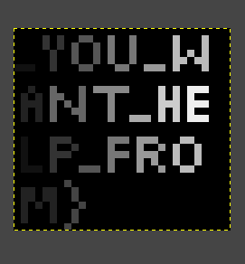

# Writeup

  We are given, at least at first glance, a ppt file, but on further examination, we can figure out that it is just a plain text file. On, reading through the provided file, we see some normal text, followed by a bunch of seemingly random numbers.

  But, we have a clue that those places are supposed to be filled with pictures. Now, we have to find out a format that relates these random numbers to pictures.

  The question also has a seemingly random reference to some PG Moment, which though at first glance seems normal, is a reference to the PGM or **Portable Greymap Format**, which stores an image's information by encoding each pixel as a number. With that information at hand, we figure out that the three chunks of information are encoded in three different, but related formats, namely PPM, PGM, and PBM respectively.

  We can then copy the data chunks starting from the line with P to the end of the chunk to seperate files. We can then open this in a photo editor, like gimp or photoshop, or other netpbm compatible programs, to read the info hidden in them, like these.

