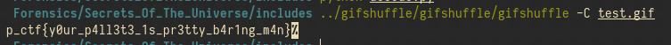

# Writeup

 We are provided with an mkv(video) file. Now as the question alludes to, the data first needs to be split up into individual pieces, in this case pictures. This can be acheived with the help of a tool like ffmpeg

```
ffmpeg -i secrets.png ch_%d.png
```

Now that the pictures are seperated, we can move onto the next part of the question. A major thing that is mentioned constantly is some **expensive ratio and its creator**, which alludes to the golden ratio, and by extension, the fibonacci series

As the question states that the storage of data respects the series, we can conclude that each picture contains only as much info as the fibonacci series demands. There is also a passing mention of **least significance**, providing a clue as to the type of stegonagraphy used

This can be decoded with a script like the one present [here](SolnStuff/decode.py)

On decoding, we are now presented with a gif file. It has on it, info regarding a pallette. That here refers to the method of hiding data in the premutations of the palette of the gif file. Another clue can be figured from the question, which has a weird mention to shuffle in it, which alludes to the tool **gifshuffle**, which is capable of concealing information in the previously mentioned way. More info regarding this can be found [here](http://www.darkside.com.au/gifshuffle/)

Now that we have got this far, it is just a matter of running

```
gifshuffle -C test.gif
```


