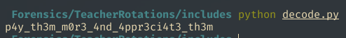

# Writeup

We are provided with an excel file, and on analyzing the actual data in the excel, there doesn't seem to have any useful information on. But the question makes numerous allusions to "rotation", and its importance. On searching online, for steganography involving rotation and excel, we are led to [this](https://www.researchgate.net/publication/49942013_Steganography_in_Ms_Excel_Document_using_Text-rotation_Technique)

So, now we understand that the data is encoded in the rotation of the text fields. But, if we try and get the data as is, by getting the rotation of each cell, we would get a grabage answer. We turn to the question again, which tells that this "secret plan" can only work if the cells are sorted. Hence, we first sort the cells based on the salary field, and can then start reading the data. It can accomplished in multiple ways. We are currently using [this](includes/decode.py) python script to get the data. If you read the first email field provided, we also get to know that the data is ascii encoded.

Hence, we can get all the data, split it and decode it accordingly to get the final answer.

## Running the script

