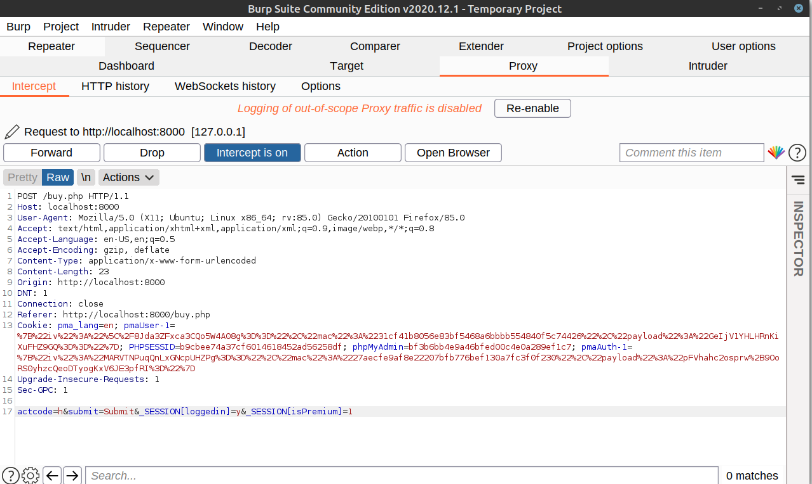

# I love memes

Our aim is to view premium memes but they have stopped selling activation codes. On viewing the source code for the application we observe that they use session variable `$_SESSION['isPremium']` to check weather we are premimum user or not. On visiting various pages  we can observer exploit at `/buy.php`. They are using the PHP extract operator. Now we can abuse this function to override global session variables. We have to observe that overriding session variables will override the entire variable and not just add a parameter. So we need to ensure that we are still logged in.    
   

Launch Burpsuite and capture the requests sent to the site. As shown above we pass the additional parameters `_SESSION[loggedin]` and `_SESSION[isPremium]`. This will ensure that we are still logged in and also make us premium member for the session. 

We get the flag 
```
p_ctf{m3m35_4r3_co0l_XD}
```